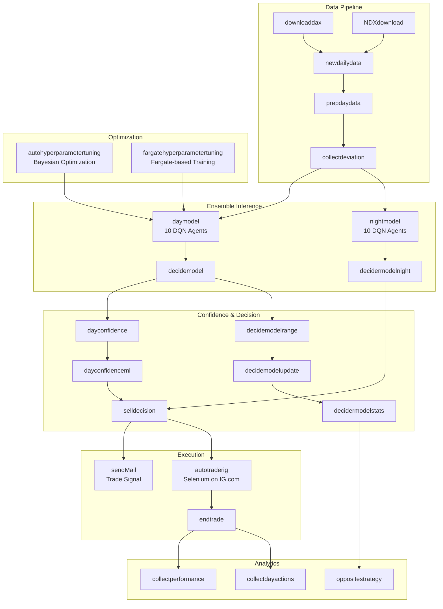
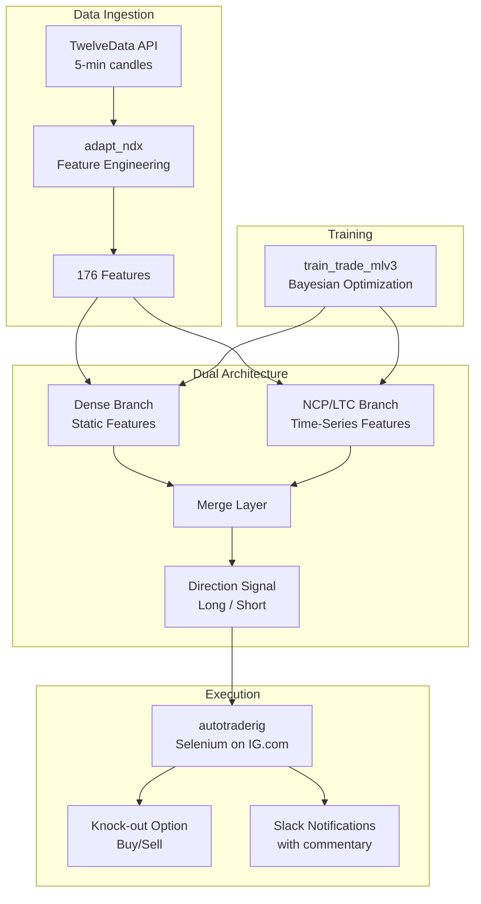
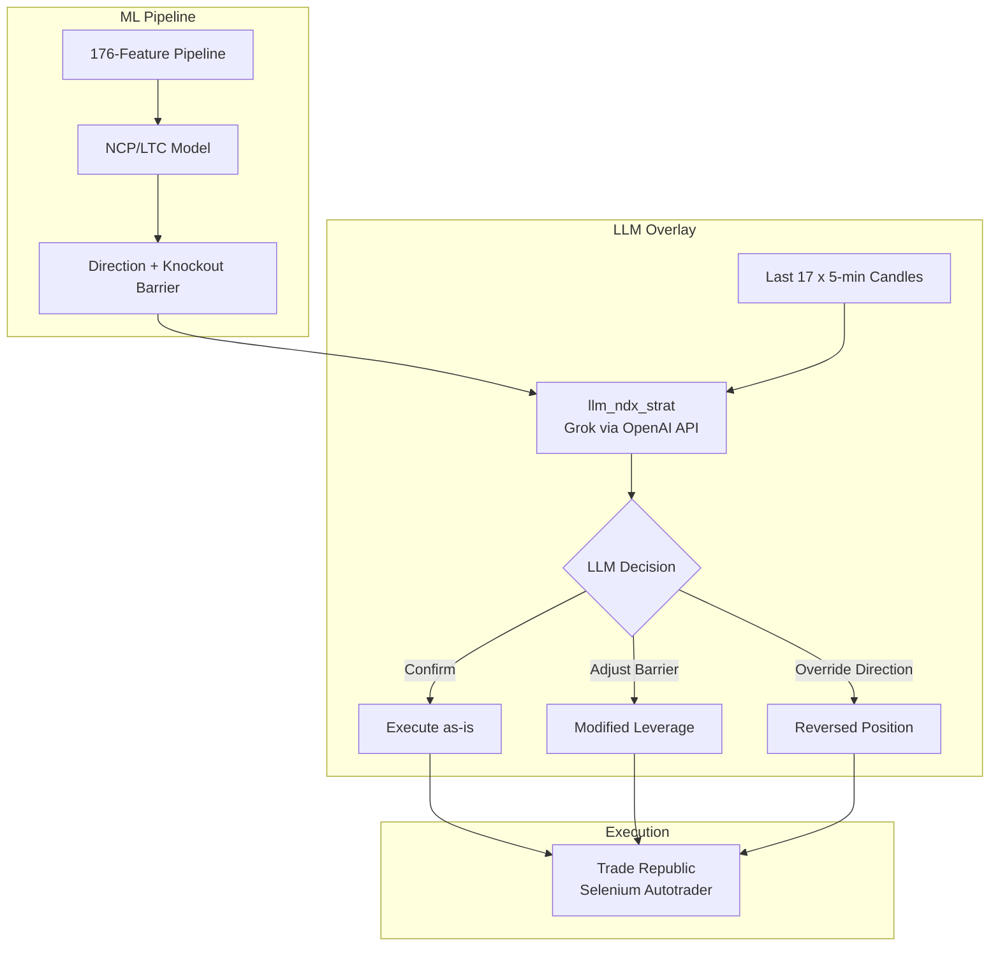

# ML Trading System: A Multi-Year Journey

**Four years, real money, 24 Lambda functions, 10 RL agents, one Selenium bot that beat Trade Republic for a few weeks, and a lot of lessons learned.**

A personal machine learning trading system that evolved from a DAX knock-out options ensemble (2021-2023) to a NASDAQ-100 NCP/LTC architecture with LLM decision overlay (2024-2025). This repository is shared as an engineering portfolio showcase.

---

## Overview

This project started in 2021 as an experiment: could a reinforcement learning ensemble trade DAX knock-out options profitably through a fully automated pipeline? Over four years, it grew from 10 DQN agents running on AWS Lambda into a dual-architecture NCP/LTC neural network with Grok LLM integration, 176 engineered features, and automated order execution via Selenium on both IG.com and Trade Republic.

The system trades European knock-out options (turbos) -- leveraged derivatives that amplify index movements but are knocked out (become worthless) if the underlying crosses a barrier level. Getting the direction right is only half the problem; setting the knockout barrier correctly determines both the leverage and the probability of total loss.

---

## System Evolution

### Phase 1: Legacy DAX System (2021-2023)

An ensemble of 10 Deep Q-Network reinforcement learning agents, split across day and night trading sessions, orchestrated by AWS Step Functions across 24 Lambda modules.



**Key characteristics:**
- 10 DQN agents per session (day/night), each voting on direction
- Custom OpenAI Gym environment simulating knock-out option P&L
- Confidence scoring via a separate ML model that evaluated ensemble agreement
- Deviation tracking: predicted vs. actual OHLC values with sigma-normalized scoring
- Automated execution via headless Chrome on IG.com, running inside Lambda
- Bayesian hyperparameter optimization using `bayes_opt`, with a Fargate option for longer runs

### Phase 2: NDX Pivot with NCP/LTC Architecture (2024)

Shifted from DAX to NASDAQ-100 and replaced the DQN ensemble with a dual-input neural architecture combining dense layers with Neural Circuit Policy (NCP) / Liquid Time-Constant (LTC) cells.



**Key characteristics:**
- NCP wiring via `AutoNCP` with LTC cells for temporal pattern recognition
- Dense branch for static/categorical features, LTC branch for time-series sequences
- 176 features including technical indicators (RSI, MACD, Bollinger, ATR, etc.), time encodings, and intraday aggregations
- Knockout barrier calculated as a percentage of current index price, with stop-loss simulation during training
- Model weights saved only when backtest performance exceeds the previous best

### Phase 3: LLM Integration (2025)

Added Grok (xAI) as a decision overlay that can confirm, adjust, or override the ML model's direction and knockout barrier.



**Key characteristics:**
- Grok receives the ML model's suggestion along with recent 5-minute candle data
- Prompted to reason about trends, volatility, and knockout barrier placement
- Can adjust the barrier to reduce leverage (move further from current price) or reverse direction entirely
- Structured JSON output for programmatic consumption
- Fallback to ML-only decision if LLM call fails

---

## Technical Highlights

| Area | Details |
|------|---------|
| **Reinforcement Learning** | 10 DQN agents with Boltzmann Q-Policy and linear-annealed exploration, custom Gym environment simulating knock-out option mechanics |
| **Bayesian Optimization** | `bayes_opt` library for hyperparameter search across layer sizes, dropout rates, learning rates, and LeakyReLU alphas |
| **NCP/LTC Cells** | Neural Circuit Policies with Liquid Time-Constant neurons (`ncps` library) for learning temporal dynamics in time-series data |
| **KAN Experiments** | Kolmogorov-Arnold Networks tested as an alternative architecture (see `notebooks/NDXkan.ipynb`) |
| **Grok Integration** | xAI's Grok LLM as a structured decision overlay via OpenAI-compatible API |
| **Selenium Automation** | Headless Chrome for both IG.com and Trade Republic, running in Lambda (with Chrome layer) and locally |
| **Feature Engineering** | 176 features from 5-minute candle data including technical indicators, time encodings, volatility measures, and deviation tracking |
| **Infrastructure** | AWS Lambda, Step Functions, S3, DynamoDB, Secrets Manager, SNS, Fargate |

---

## Trade Notifications (Yes, Really)

The autotrader sends SNS/Slack notifications on every trade with randomly selected messages. A few highlights from the actual codebase:

**Buying:**
> "This ain't no casino, but we're betting big on these options!" 🎲
>
> "Who needs a lottery ticket when we've got these options?" 🎟️
>
> "Strapping in for a wild ride! Firing up these options!" 🎢

**Selling at a profit:**
> "Cha-ching! Another successful mission for our rocket crew!" 🚀
>
> "Just sold for a profit, and now we're dancing to the tendie tango!" 💃
>
> "Profits in the bag! Sold like a true WallStreetBets champ!" 🥊

**Selling at a loss:**
> "Took a hit, but we're still swinging for the fences!" ⚾
>
> "Even WallStreetBets legends need a little hiccup to keep things interesting!" 😉
>
> "It's not about how many times you fall, but how many times you get back up!" 🆙

**Stop loss:**
> "Ouch, that stop loss stings, but we'll bounce back even stronger!" 💪
>
> "Brace for impact! We hit the stop loss, but that's just a pitstop on our racetrack to the stars." 🏁🚀🌟

These messages were sent to my phone in real time. There is something uniquely humbling about receiving "The stop loss is just a detour on our path to victory!" while your knock-out option has just been wiped out.

See the full collection in [`legacy/autotraderig/app.py`](legacy/autotraderig/app.py) and [`v2/autotraderig/app.py`](v2/autotraderig/app.py).

---

## Trade Republic Automation

The [`traderepublic_trader/`](traderepublic_trader/) directory contains a Selenium-based automation script for Trade Republic's desktop web app. It uses a binary search algorithm through infinite scroll to locate knock-out certificates matching a target knockout barrier level. See the [Trade Republic Trader README](traderepublic_trader/README.md) for the full story.

**Note:** Automating a broker's web interface almost certainly violates their Terms of Service. This code is no longer functional (Trade Republic removed the infinite scroll) and is preserved solely as an engineering showcase. Do not use it.

---

## Repository Structure

```
.
├── legacy/                         # Phase 1: DAX trading system (2021-2023)
│   ├── NDXdownload/                # NASDAQ-100 daily data download
│   ├── autohyperparametertuning/   # Bayesian hyperparameter optimization
│   ├── autotraderig/               # Selenium-based IG.com trade execution
│   ├── collectdayactions/          # Aggregate daily confidence actions
│   ├── collectdeviation/           # Track prediction vs. actual deviations
│   ├── collectperformance/         # Record strategy performance metrics
│   ├── dayconfidence/              # Day confidence scoring model
│   ├── dayconfidenceml/            # ML-based confidence with DynamoDB state
│   ├── daymodel/                   # Day session DQN ensemble (10 agents)
│   ├── decidemodel/                # Decision model combining signals
│   ├── decidemodelrange/           # Range-based decision refinement
│   ├── decidemodelupdate/          # Update decision parameters
│   ├── decidermodelnight/          # Night session decision model
│   ├── decidermodelstats/          # Decision statistics with Bayesian optimization
│   ├── downloaddax/                # DAX daily data download
│   ├── endtrade/                   # Close open positions
│   ├── fargatehyperparametertuning/# Fargate-based long-running optimization
│   ├── ndxagent/                   # NDX reinforcement learning agent
│   ├── newdailydata/               # Daily data pipeline with feature engineering
│   ├── nightmodel/                 # Night session DQN ensemble (10 agents)
│   ├── oppositestrategy/           # Contrarian strategy analysis
│   ├── prepdaydata/                # Prepare and enrich daily data
│   ├── selldecision/               # Sell timing and exit logic
│   └── sendMail/                   # Email/SNS trade notifications
├── v2/                             # Phase 2-3: NDX system (2024-present)
│   ├── adapt_ndx/                  # NDX data adaptation and feature engineering
│   ├── autotraderig/               # Selenium-based IG.com autotrader (V2)
│   ├── llm_ndx_strat/              # Grok LLM decision overlay
│   └── train_trade_mlv3/           # NCP/LTC model training with Bayesian optimization
├── traderepublic_trader/           # Selenium Trade Republic automation
│   ├── trade_traderepublic.py      # Binary search knockout finder
│   └── trade_buy.py                # Earlier buy-only version
├── notebooks/                      # Experimental notebooks
│   ├── NDXkan.ipynb                # KAN network experiments
│   └── UpDownML.ipynb              # Early ML experiments
├── REDACTION_NOTICE.md             # What was redacted and why
└── README.md                       # This file
```

---

## Tech Stack

- **ML/DL:** TensorFlow/Keras, keras-rl (DQN), ncps (NCP/LTC), KAN
- **Optimization:** bayes_opt (Bayesian Optimization)
- **LLM:** Grok (xAI) via OpenAI-compatible API
- **Data:** TwelveData API, pandas, ta (technical analysis), scikit-learn
- **Automation:** Selenium, undetected-chromedriver
- **Infrastructure:** AWS Lambda, Step Functions, S3, DynamoDB, Secrets Manager, SNS, Fargate
- **Language:** Python

---

## Lessons Learned

A few hard-won insights from four years of putting real money behind ML models:

- **RL train/test leakage is silent and deadly.** The DQN agents produced beautiful wealth charts projecting millions of euros in profits. The problem? Training and testing were never truly separated. The agents were memorizing historical sequences, not learning generalizable patterns. Any backtest chart expecting millions is probably overfitting to the moon.

- **DQN agents are degenerate traders.** The 10-agent ensemble looked impressive on paper, but the agents converged on aggressive, correlated strategies. They were less "wisdom of crowds" and more "ten gamblers agreeing to go all-in."

- **The cobbler's children have no shoes.** I was doing Infrastructure as Code professionally during the entire time I built this system. Did I use IaC for my own project? No. Every Lambda was hand-configured through the AWS console. 24 of them. I have no explanation for this.

- **TensorFlow and RL packages are a maintenance nightmare.** Version pinning, breaking API changes, CUDA compatibility matrices -- maintaining `keras-rl` alongside TensorFlow across system upgrades consumed more time than actual model development. I resisted switching to PyTorch for far too long, for reasons I can no longer reconstruct.

- **NCP/LTC cells were the real breakthrough.** After the RL disaster, Neural Circuit Policies with Liquid Time-Constant cells provided genuinely better out-of-sample generalization. The variable time constants seem to handle the irregular dynamics of intraday price data well. Sometimes the less fashionable architecture is the right one.

---

## What's Redacted

This repository is sanitized for public sharing. See [REDACTION_NOTICE.md](REDACTION_NOTICE.md) for full details on the three-tier redaction approach. In short: secrets are scrubbed, infrastructure names are genericized, and V2 strategy parameters are hidden. Neither the legacy nor the V2 strategy is actively traded -- both are preserved as engineering references.

---

Built with TensorFlow, too much coffee, and a tolerance for financial risk that my future self may question.
