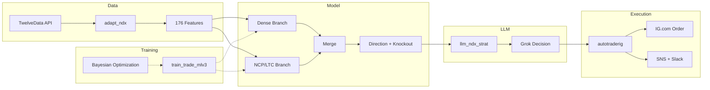

# V2: NASDAQ-100 Trading System (2024-2025)

The V2 system pivoted from DAX to NASDAQ-100, replaced the 10-agent DQN ensemble with a dual-input NCP/LTC neural architecture, added a 176-feature engineering pipeline, and integrated Grok (xAI) as an LLM decision overlay.

**Note:** Strategy parameters (knockout factors, stop-loss thresholds, model hyperparameters) are redacted in V2 code. The architecture and logic are fully visible. See [REDACTION_NOTICE.md](../REDACTION_NOTICE.md) for details.

---

## Modules

### `train_trade_mlv3/` -- Model Training

The core model uses a dual-input architecture:

- **Dense Branch:** Processes static and categorical features (time encodings, indicator snapshots) through Dense layers with LeakyReLU activation, Dropout, and BatchNormalization
- **NCP/LTC Branch:** Processes time-series features through two stacked Liquid Time-Constant (LTC) cells with Neural Circuit Policy (NCP) wiring via `AutoNCP`. LTC cells learn temporal dynamics with variable time constants, making them particularly suited to irregular financial time-series

The two branches are concatenated and passed through a merge layer to produce a binary direction signal (long vs. short).

Training uses Bayesian optimization (`bayes_opt`) to search across:
- Layer sizes for all three dense layers
- Dropout rates and LeakyReLU alphas
- LSTM/LTC cell sizes for both NCP layers
- Epoch count and batch size

Model weights are saved to S3 only when backtested performance on a held-out test set exceeds the previous best. The backtest simulates knock-out option P&L including stop-loss mechanics.

### `adapt_ndx/` -- Feature Engineering

Fetches 5-minute NASDAQ-100 candle data from TwelveData API and engineers 176 features including:
- Technical indicators via the `ta` library (RSI, MACD, Bollinger Bands, ATR, Stochastic, Williams %R, CCI, and more)
- One-hot encoded time features (weekday, month-day)
- Intraday price aggregations and returns
- Volatility measures and deviation tracking

The output is structured as two numpy arrays: one for the dense branch (static features) and one for the LTC branch (sequential features).

### `llm_ndx_strat/` -- Grok LLM Decision Overlay

Integrates Grok (xAI) as a decision layer on top of the ML model's output. The LLM receives:
- The ML model's suggested direction (Long/Short) and knockout barrier
- The most recent 17 five-minute candles (OHLC)
- The current index price and distance to the suggested barrier

The LLM is prompted to:
1. Analyze the candle data for trends and volatility
2. Decide whether to confirm the ML direction or override it
3. Set an appropriate knockout barrier (can adjust for more or less leverage)
4. Explain its reasoning

The response is structured JSON with action, direction, barrier, and a comment. If the LLM overrides the ML model's direction, it must maintain at least equivalent distance from the current price to avoid accidentally increasing leverage.

### `autotraderig/` -- Selenium Autotrader

Selenium-based headless Chrome automation for IG.com, running in AWS Lambda with a Chrome binary layer. Handles:
- Login with credentials from AWS Secrets Manager
- Account selection (Turbo24)
- Order placement for knock-out options
- Position monitoring and closure
- Screenshot capture to S3 for debugging

Sends trade notifications via SNS with randomized commentary messages -- a curated collection of buy messages ("Strapping in for a wild ride!"), win messages ("Cha-ching! Another successful mission!"), loss messages ("Took a hit, but we're still swinging!"), and stop-loss messages ("Ouch, that stop loss stings, but we'll bounce back!").

---

## Architecture Diagram

---

## NCP/LTC Architecture

Neural Circuit Policies (NCP) with Liquid Time-Constant (LTC) neurons are a biologically-inspired architecture originally developed for robot control. In this system, they serve as the temporal processing branch:

- **LTC cells** maintain a continuous-time hidden state with learned time constants, allowing them to adapt their temporal resolution to the data
- **NCP wiring** (`AutoNCP`) automatically generates sparse, structured connectivity patterns between neurons, reducing parameter count while maintaining expressiveness
- Two stacked LTC layers process the sequential features, with the second layer producing a single output that is merged with the dense branch

This architecture was chosen over standard LSTM/GRU cells after experimentation showed better generalization on out-of-sample financial data, likely due to the variable time constants matching the irregular dynamics of intraday price movements.

---

## What's Not Included

- Trained model weights (`.h5f` files)
- Training data (`.csv`, `.npz` files)
- Saved hyperparameter configurations (`params.json`)
- Model structure definitions (`model_structure.json`)
- Performance tracking data
- Other V2 modules not selected for this showcase (`do_inference`, `prepare_data`, `check_retrain`, etc.)
